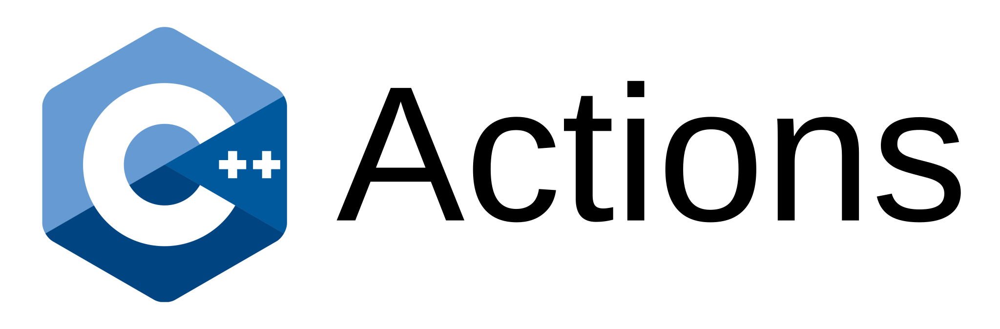

= C++ Actions
Alan Freitas <alandefreitas@gmail.com>
:description: GitHub Actions for C++ Libraries
:sectanchors:
:url-repo: https://github.com/alandefreitas/cpp-actions
:page-tags: cpp-actions
:navtitle: Home

NOTE: READ THE DOCS: https://alandefreitas.github.io/cpp-actions/

